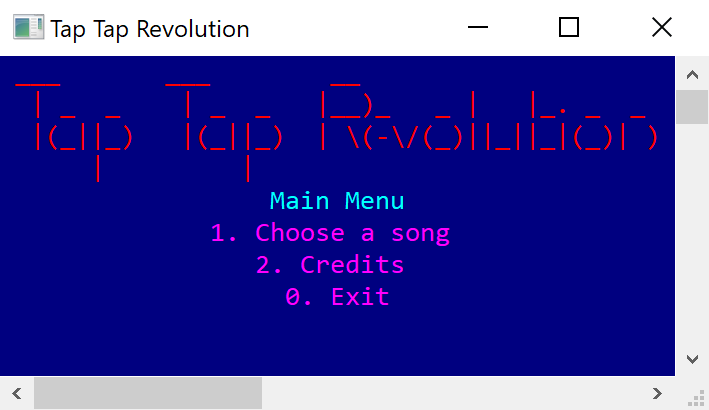
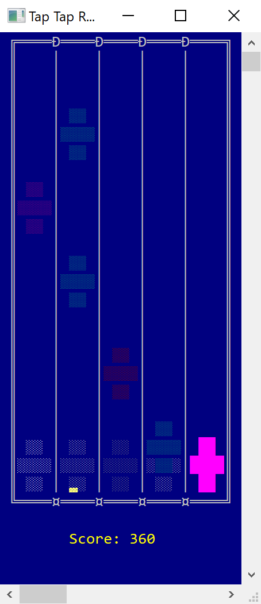

# Tap Tap Revolution

A C++ rhythm game that uses only the console window for graphics.

<p align="center">
  
</p>

This was my summative project for the Grade 11 Computer Engineering (TEJ3M) course. Originally, this game was designed to be played using a simple controller I built via parallel port. This repository is a port of the original, made playable with the keyboard.

## Installation

Compile with `-std=c++11` and `-lwinmm` (required for audio playback using the MCI command `mciSendString()`)

Example:
```sh
> g++ -std=c++11 -o TapTapRevolution.exe -I include/ main.cpp src/* -lwinmm
```

Note: Tap Tap Revolution makes a lot of *Windows* API calls to manipulate the console size, change colour, etc.

## Gameplay



### Controls
- Press `w` and `s` to navigate menus and `Enter` to select, or press the number of the item
- Each column has a corresponding key:
  - `[d] [f] [Space] [j] [k]`

After selecting a song, notes will start falling from five columns, following the rhythm of the song. When a note reaches the bottom of a column, tap the corresponding key to hit the note. If the note isn't hit on time, it will be missed.

### Scoring
- Hit note: +1
- Missed note: -1
- Final rank:
  - SS: All notes hit
  - S: > 90% max score
  - A: > 80% max score
  - B: > 70% max score
  - C: > 60% max score
  - D: > 50% max score
  - Fail: <= 50% max score

## Music Data File Format

Each song has a data file that contains information about the song and the notes. For the game to detect a song, the data file must:

- be in the `songs` directory
- have a `.txt` file extension
- have the same filename as an `.mp3` in the `songs` directory

These data files follow a simple format:

- `Title of Song`
- `Delay until first note` (in ms)
- `BPM`
- `Number of notes`
- For each note:
  - `Number of note` (starting at 1)
  - `Column of note` (1 to 5)
  - `Time between note and next note` (in ms)
    - For the last note, this is the delay between the last note and the end of the song
    - For simultaneous notes, set this to 0

## License

[MIT](./LICENSE)
